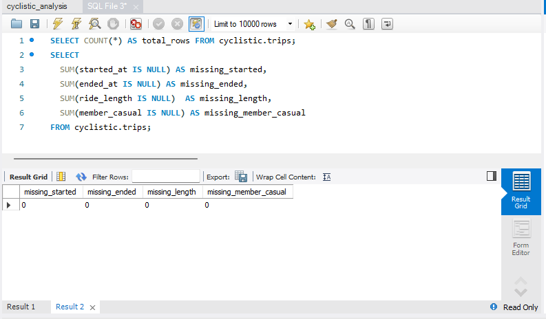
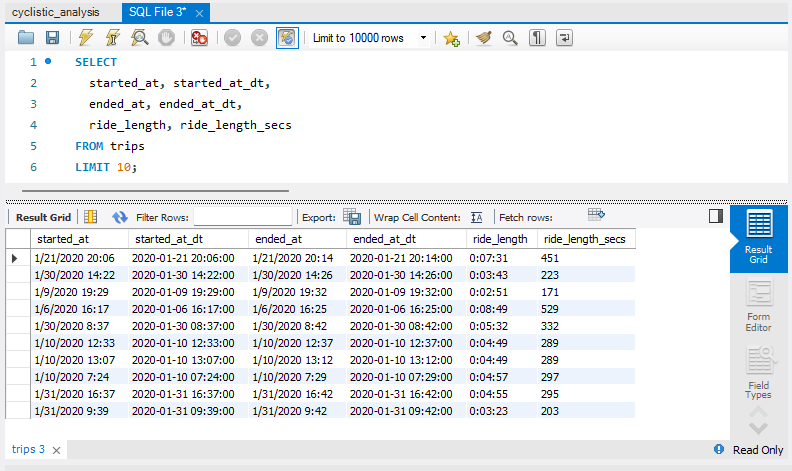
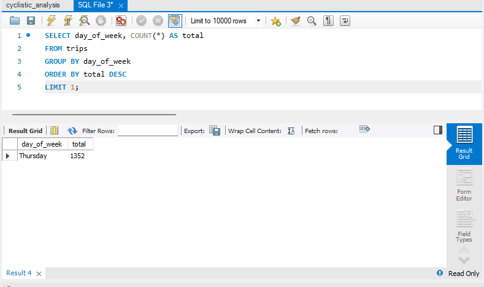

# 🚴‍♂️ Cyclistic Bike-Share Case Study — Google Data Analytics Capstone  
### *Excel • SQL • R | End-to-End Data Analytics Project*

---

# Table of Contents  

1. [Overview](#-overview)  
2. [Project Files](#-project-files)  
3. [Dataset Story](#-dataset-story)  
4. [ASK — Define the Business Task](#-ask--define-the-business-task)  
5. [PREPARE — Data Source & Credibility](#-prepare--data-source--credibility)  
6. [PROCESS — Cleaning & Feature Engineering](#-process--cleaning--feature-engineering)  
   - [Excel Cleaning](#excel)  
   - [SQL Cleaning & Outputs](#sql-mysql-80-workbench)  
   - [R Cleaning](#r-tidyverse--lubridate)  
7. [ANALYZE — Key Findings](#-analyze--key-findings)  
8. [SHARE — Visualizations](#-share--visualizations)  
   - [Excel Dashboard](#excel-dashboard)  
   - [R Visualizations](#r-visualizations-ggplot2)  
9. [ACT — Final Recommendations](#-act--final-recommendations)  

---

## 📌 Overview

This project analyzes data from the **Cyclistic Divvy Q1 2020 bike-share dataset**, originally containing over **300,000 rows**.  
To ensure smooth performance across tools, the dataset was reduced to **8,036 rows** while preserving distribution and patterns.

The goal of the project is to understand **how casual riders and annual members use Cyclistic bikes differently**, and develop **data-driven marketing recommendations** to increase annual membership conversions.

The analysis follows the **Google Data Analytics process**:  
**Ask → Prepare → Process → Analyze → Share → Act**

Work was performed in **Excel**, **MySQL**, and **RStudio (tidyverse, lubridate, ggplot2)**.

---

## 📂 Project Files

| File Name | Description |
|-----------|-------------|
| `cyclistic_analysis.xlsx` | Excel cleaning, pivot tables, dashboards, KPI metrics |
| `cyclistic_analysis.sql` | SQL cleaning + analysis queries |
| `cyclistic_analysis.R` | R data cleaning, analysis, ggplot visualizations |
| `cyclistic_workspace.RData` | Saved R environment |

---

## 🧵 Dataset Story

### **Original Attributes (Raw Dataset)**
- `ride_id`, `rideable_type`  
- `started_at`, `ended_at`  
- `start_station_name`, `start_station_id`  
- `end_station_name`, `end_station_id`  
- `start_lat`, `start_lng`, `end_lat`, `end_lng`  
- `member_casual`

### **New Attributes Created (Process Phase)**

**Excel:** `ride_length`, `day_of_week`, `start_hour`, `start_month`  
**SQL:** `started_at_dt`, `ended_at_dt`, `ride_length_secs`, `ride_length_mins`  
**R:** `weekday`, `started_hour_new`, `started_month_new`, `started_date`, `is_weekend`

These engineered features allowed deeper behavioral analysis.

---

## 🧠 ASK — Define the Business Task

**Key Question:**  
> How do annual members and casual riders use Cyclistic bikes differently?

Cyclistic aims to **convert casual riders into annual members** using targeted marketing campaigns.

---

## 🗄 PREPARE — Data Source & Credibility

- Dataset: Divvy Q1 2020 public data  
- License: Motivate International Inc.  
- No PII included  
- Data stored in Excel, MySQL, and RStudio  
- Follows ROCCC: Reliable, Original, Comprehensive, Current, Cited  

---

## 🧹 PROCESS — Cleaning & Feature Engineering

### Excel
- Converted timestamps  
- Calculated ride length  
- Added weekday, hour, and month columns  
- Removed invalid or zero-duration rides  

---

### SQL (MySQL 8.0 Workbench)  

#### **Total Rows Loaded**  
  

#### **Missing Values Check** 
  

#### **First 10 Rows Preview**  
  

#### **Average Ride Duration (SQL)**  
  

#### **Maximum Ride Duration**  
  

#### **Ride Length in Seconds & Minutes**  
  

#### **Most Active Day of Week**  
  

#### **Avg Ride Duration: Member vs Casual**  
  

#### **Total Rides: Member vs Casual**  
  

#### **Hourly Ride Distribution**  
  

#### **Monthly Ride Distribution**  
  

---

### R (tidyverse + lubridate)
- Cleaned names  
- Parsed timestamps  
- Calculated duration  
- Derived weekday/weekend/hour/month  
- Performed grouped summaries  
- Built ggplot2 charts  

---

## 📊 ANALYZE — Key Findings

### **Ride Duration**
- Casual riders have **longer rides** (~388 mins avg)  
- Members take **shorter, more consistent rides** (~279 mins avg)

### **Usage Volume**
- Members contribute **over 90% of all rides**

### **Day Patterns**
- Casuals: **mid-week + weekend peaks**  
- Members: **weekday stable usage (commuting)**  

### **Hourly Patterns**
- Members peak: **7–9 AM** & **4–6 PM**  
- Casuals: **mid-day & afternoon**  

### **Geographic Hotspots**
Common casual rider locations:  
- Michigan Ave & Washington St  
- Millennium Park  
- Lake Shore Dr & Monroe St  

---

## 📈 SHARE — Visualizations

### Excel Dashboard  
  
**Dashboard summarizing KPIs, ride distribution, and user breakdown.**

---

## R Visualizations (ggplot2)

#### Ride Length Summary  
  
**Displays spread and distribution of trip durations.**

#### Average Ride Length by User Type  
  
**Casual riders take significantly longer rides.**

#### Average Ride Length by Day of Week
  
**Highlights weekday vs weekend differences.**

#### Number of Rides by Day  
  
**Shows daily ride volume distribution.**

#### Hourly Usage Pattern by User Type  
  
**Shows commuting vs leisure hour patterns.**

#### Top Start Stations by User Type  
  
**Lists most frequently used start stations.**

---

## 🧭 ACT — Final Recommendations

### **1️⃣ Target casual riders at leisure-heavy stations**  
Focus: Millennium Park, Lakefront, Michigan Ave.  
Use QR codes, app offers, and tourist-focused promotions.

### **2️⃣ Introduce weekend / tourist-friendly membership options**  
Examples:  
- **Weekend Unlimited Pass**  
- **Tourist → Monthly Upgrade Discount**

### **3️⃣ Leverage digital media to convert casual riders**  
Highlight:  
- Cost savings  
- Convenience  
- Unlimited rides  
- Rewards/points  
- No per-ride charges  

These align well with casual rider behaviors.

---
